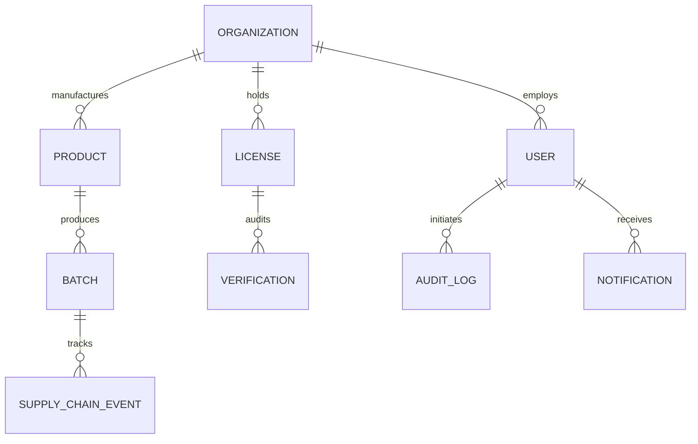

# Secure Pharma — Database & Data Model Architecture

Secure Pharma uses **MongoDB** managed through **Mongoose** with optimized compound indexing, explicit enums, cryptographic hash storage, and foreign reference mapping.

---

## 1. Data Models Overview

---

## 2. Collections & Schema Definitions

### 1. `users`
- `_id`: ObjectId
- `name`: String (required, trimmed)
- `email`: String (required, unique, lowercase, indexed)
- `password`: String (bcrypt hash)
- `role`: Enum (`SUPER_ADMIN`, `REGULATOR`, `MANUFACTURER`, `DISTRIBUTOR`, `PHARMACY`)
- `organization`: ObjectId -> `organizations`
- `accountStatus`: Enum (`PENDING`, `UNDER_REVIEW`, `APPROVED`, `REJECTED`, `SUSPENDED`)
- `rejectionReason`: String
- `resetPasswordToken`: String (hashed)
- `resetPasswordExpires`: Date
- `lastLogin`: Date

### 2. `organizations`
- `_id`: ObjectId
- `name`: String (required, indexed)
- `type`: Enum (`MANUFACTURER`, `DISTRIBUTOR`, `PHARMACY`, `REGULATOR`)
- `registrationNumber`: String
- `address`: String
- `contactEmail`: String
- `contactPhone`: String
- `status`: Enum (`PENDING`, `UNDER_REVIEW`, `APPROVED`, `REJECTED`, `SUSPENDED`, indexed)
- `rejectionReason`: String
- `suspensionReason`: String

### 3. `licenses`
- `_id`: ObjectId
- `organization`: ObjectId -> `organizations` (indexed)
- `licenseNumber`: String (required, unique, uppercase)
- `licenseType`: Enum (`MANUFACTURING`, `WHOLESALE`, `PHARMACY`, `IMPORT_EXPORT`)
- `issuingAuthority`: String (e.g. "Federal Drug Control Agency")
- `issueDate`: Date
- `expiryDate`: Date (indexed)
- `documentPath`: String (uploads path)
- `documentHash`: String (SHA-256 tamper hash)
- `verificationStatus`: Enum (`PENDING`, `UNDER_REVIEW`, `APPROVED`, `VERIFIED`, `REJECTED`, `EXPIRED`, indexed)
- `rejectionReason`: String
- `verifiedBy`: ObjectId -> `users`
- `verifiedDate`: Date

### 4. `products`
- `_id`: ObjectId
- `name`: String (required, indexed)
- `genericName`: String
- `brandName`: String
- `productCode`: String (required, unique, uppercase, GTIN/NDC)
- `regulatoryApprovalNumber`: String
- `manufacturer`: ObjectId -> `organizations` (indexed)
- `category`: String
- `dosageForm`: String
- `strength`: String
- `packageSize`: String
- `description`: String
- `storageRequirements`: String
- `status`: Enum (`ACTIVE`, `INACTIVE`, indexed)

### 5. `batches`
- `_id`: ObjectId
- `batchNumber`: String (required, unique, uppercase)
- `product`: ObjectId -> `products` (indexed)
- `manufacturer`: ObjectId -> `organizations` (indexed)
- `manufacturingDate`: Date
- `expiryDate`: Date (indexed)
- `quantity`: Number (min: 1)
- `unit`: String (e.g. "Bottles", "Vials")
- `status`: Enum (`CREATED`, `MANUFACTURED`, `IN_TRANSIT`, `RECEIVED`, `DISTRIBUTED`, `SOLD`, `EXPIRED`, `RECALLED`, `FLAGGED`, indexed)
- `storageRequirements`: String
- `qrIdentifier`: String (required, unique, e.g. `SP-UUID`)
- `qrCodeDataUrl`: String
- `batchHash`: String (SHA-256 batch fingerprint)
- `recallReason`: String
- `flagReason`: String

### 6. `supplychainevents`
- `_id`: ObjectId
- `batch`: ObjectId -> `batches` (indexed)
- `eventType`: Enum (`MANUFACTURED`, `DISPATCHED`, `SHIPPED`, `RECEIVED`, `TRANSFERRED`, `DELIVERED`, `SOLD`, `RETURNED`, `RECALLED`, `FLAGGED`, indexed)
- `fromOrganization`: ObjectId -> `organizations` (indexed)
- `toOrganization`: ObjectId -> `organizations` (indexed)
- `location`: String
- `user`: ObjectId -> `users`
- `quantity`: Number
- `notes`: String
- `uniqueEventId`: String (e.g. `EVT-UUID`)
- `transactionHash`: String (SHA-256 custodial anchor)
- `eventDate`: Date (indexed)

### 7. `verifications`
- `_id`: ObjectId
- `license`: ObjectId -> `licenses`
- `organization`: ObjectId -> `organizations`
- `batch`: ObjectId -> `batches`
- `identifier`: String (indexed)
- `verificationType`: Enum (`LICENSE_VERIFICATION`, `PRODUCT_QR_SCAN`, `PUBLIC_BATCH_QUERY`)
- `status`: Enum (`PENDING`, `APPROVED`, `VERIFIED`, `REJECTED`, `AUTHENTIC`, `SUSPICIOUS`, `EXPIRED`, `RECALLED`, `NOT_FOUND`, indexed)
- `verifiedBy`: ObjectId -> `users`
- `verificationDate`: Date (indexed)
- `remarks`: String
- `ipAddress`: String
- `metadata`: Mixed (e.g. 9-point checks object)

### 8. `auditlogs`
- `_id`: ObjectId
- `user`: ObjectId -> `users` (indexed)
- `organization`: ObjectId -> `organizations` (indexed)
- `action`: String (indexed, e.g. `USER_REGISTERED`, `LICENSE_APPROVED`)
- `entityType`: String (indexed)
- `entityId`: ObjectId
- `details`: String / Mixed
- `ipAddress`: String
- `metadata`: Mixed
- `createdAt`: Date (indexed, descending)

### 9. `notifications`
- `_id`: ObjectId
- `recipientUser`: ObjectId -> `users` (indexed)
- `recipientRole`: Enum (`SUPER_ADMIN`, `REGULATOR`, `MANUFACTURER`, `DISTRIBUTOR`, `PHARMACY`, `ALL`, indexed)
- `recipientOrg`: ObjectId -> `organizations` (indexed)
- `type`: Enum (`LICENSE_SUBMITTED`, `LICENSE_APPROVED`, `LICENSE_REJECTED`, `LICENSE_EXPIRING`, `BATCH_RECEIVED`, `BATCH_TRANSFERRED`, `SUSPICIOUS_PRODUCT`, `VERIFICATION_COMPLETED`, `ACCOUNT_STATUS_CHANGED`, `GENERAL`)
- `title`: String
- `message`: String
- `isRead`: Boolean (default: false, indexed)
- `relatedEntity`: String
- `relatedEntityId`: ObjectId
- `createdAt`: Date (indexed)
